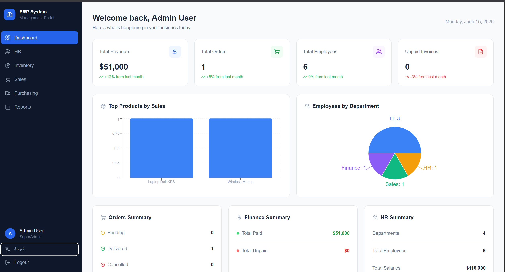
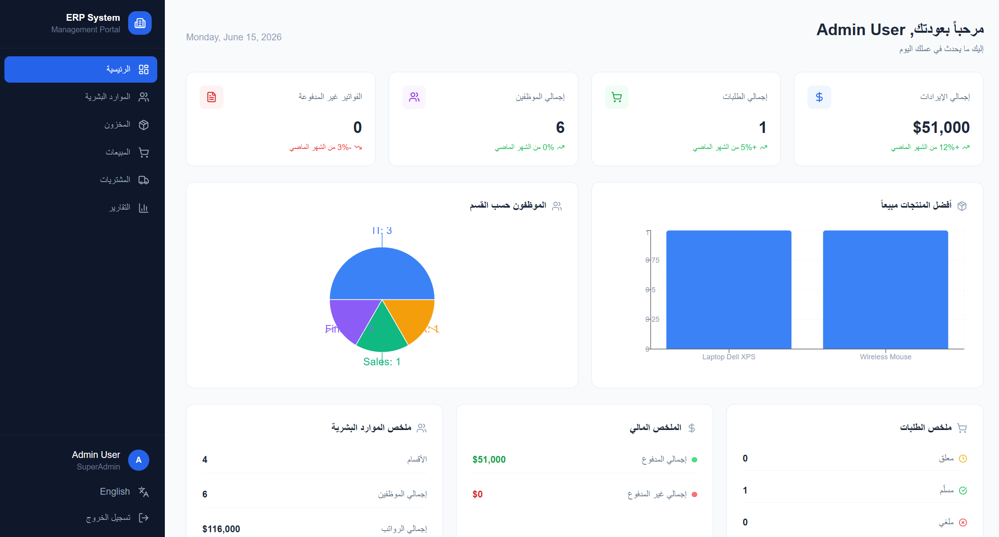
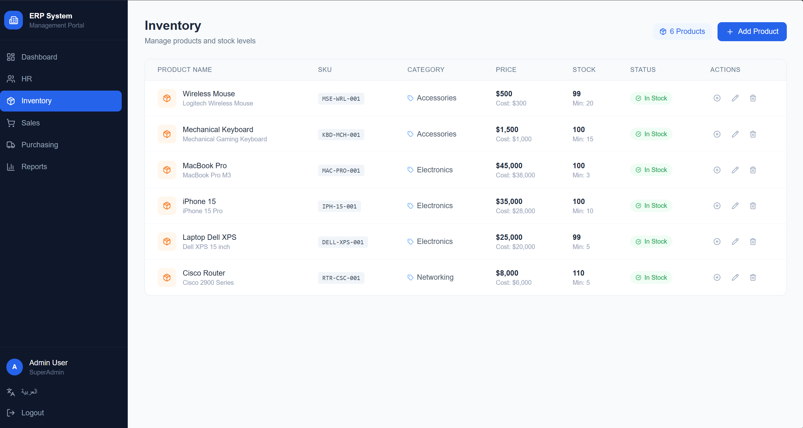
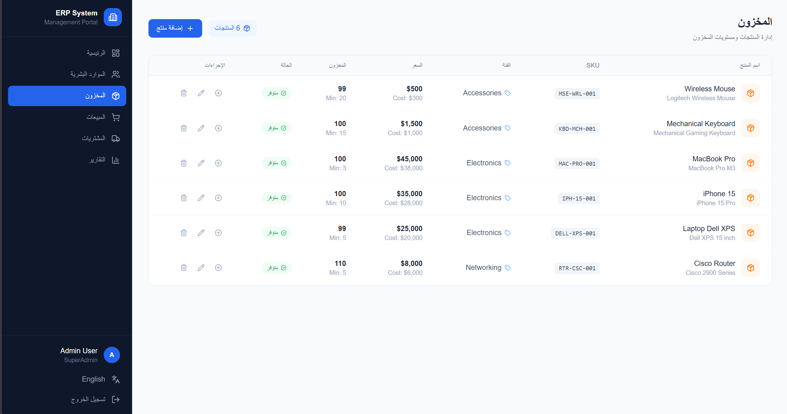
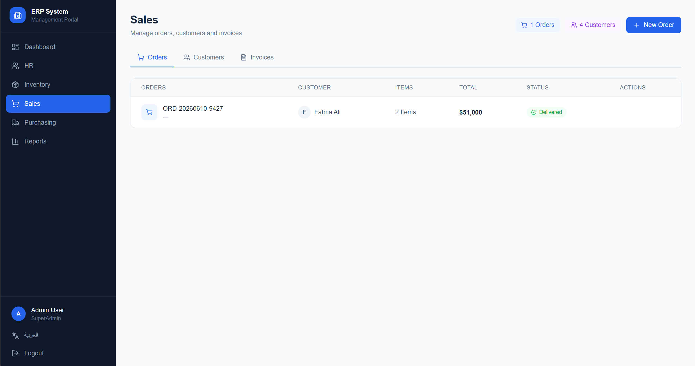
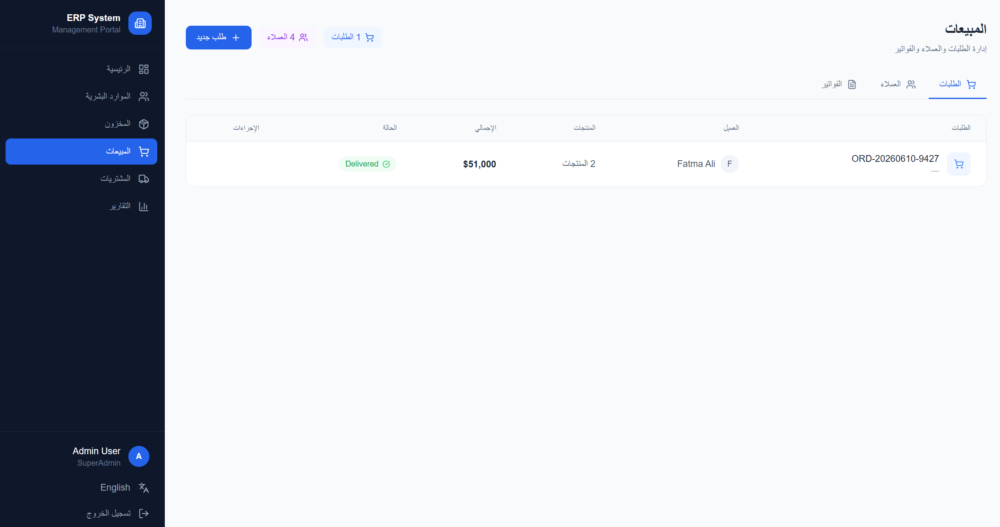
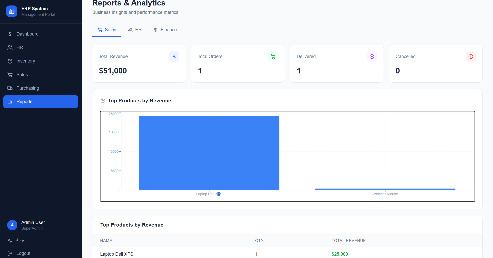
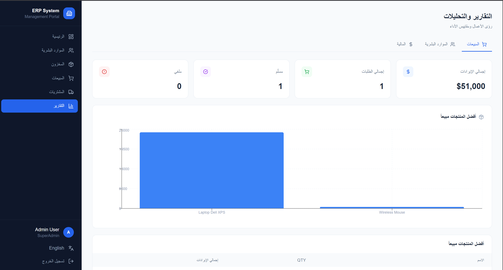

# 🏢 ERP System

A comprehensive Enterprise Resource Planning (ERP) system built with **.NET 8** and **React**, following **Clean Architecture** principles.

## 🚀 Features

- **Authentication & Authorization** — JWT + Role-Based Access Control (RBAC)
- **HR Module** — Employees, Departments management
- **Inventory Module** — Products, Categories, Stock management
- **Sales Module** — Orders, Customers, Invoices
- **Purchasing Module** — Purchase Orders, Suppliers
- **Reports & Analytics** — Business insights and performance metrics
- **Telegram Notifications** — Real-time order and payment notifications
- **Multi-language** — Arabic / English support (i18n)

## 🛠️ Tech Stack

### Backend
| Technology | Purpose |
|------------|---------|
| .NET 8 Web API | Backend framework |
| Clean Architecture | Project structure |
| Entity Framework Core | ORM |
| SQL Server | Database |
| JWT Authentication | Security |
| BCrypt | Password hashing |

### Frontend
| Technology | Purpose |
|------------|---------|
| React + TypeScript | Frontend framework |
| Tailwind CSS | Styling |
| Recharts | Data visualization |
| Lucide React | Icons |
| react-i18next | Internationalization |
| Axios | HTTP client |

## 📐 Architecture

```
ERP.sln
├── src/
│   ├── ERP.Domain          # Entities, Business Rules
│   ├── ERP.Application     # Use Cases, Interfaces, Services
│   ├── ERP.Infrastructure  # Database, Repositories, External Services
│   └── ERP.API             # Controllers, Middleware
└── erp-frontend-v2/        # React Frontend
```

## 🗄️ Modules

```
├── Auth          → Login, Register, Roles, Permissions
├── HR            → Employees, Departments
├── Inventory     → Products, Categories, Stock
├── Sales         → Orders, Customers, Invoices
├── Purchasing    → Purchase Orders, Suppliers
└── Reports       → Sales, HR, Finance Analytics
```

## ⚙️ Setup

### Backend

1. Clone the repository
2. Update connection string in `appsettings.json`
3. Run migrations:
```bash
Update-Database -Project ERP.Infrastructure -StartupProject ERP.API
```
4. Run the API:
```bash
dotnet run --project src/ERP.API
```

### Frontend

```bash
cd erp-frontend-v2
npm install
npm run dev
```
## 📸 Screenshots

### 📊 Dashboard

| English | Arabic |
|----------|---------|
|  |  |

### 👥 HR Management

| English | Arabic |
|----------|---------|
|  |  |

### 📦 Inventory Management

| English | Arabic |
|----------|---------|
|  |  |

### 💰 Sales Management

| English | Arabic |
|----------|---------|
|  |  |

### 📈 Reports & Analytics

| English | Arabic |
|----------|---------|
|  |  |

## 🔑 Default Credentials

```
Email: admin@erp.com
Password: Admin@123
```